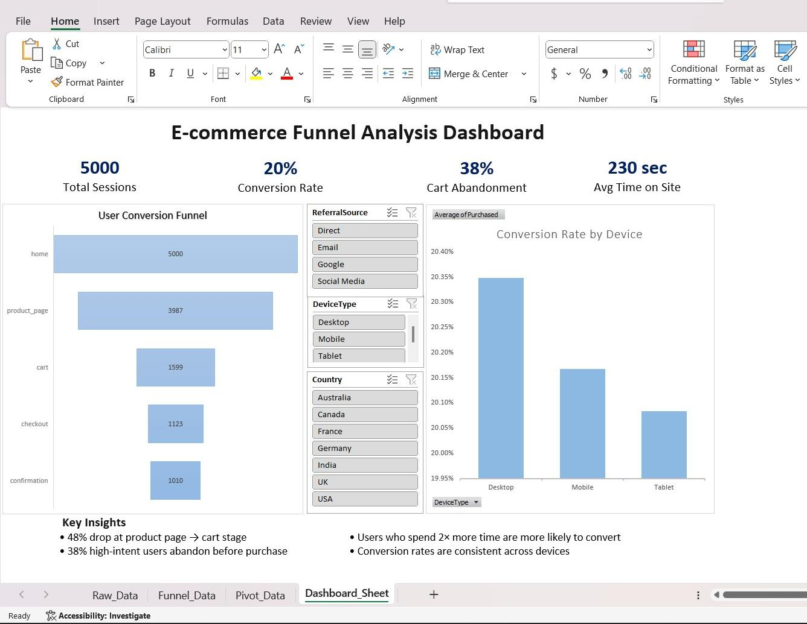

# E-commerce Funnel Analysis

## 📌 Objective
Analyze user journey data to identify drop-off points and improve conversion rates.

---

## 📊 Dataset
- 5000+ user sessions
- Features: Device, Country, Referral Source, Time on Page, Cart Activity
- Data transformed from event-level to session-level

---

## 🧠 Key Insights
- 48% drop at product page → cart stage  
- Users with higher engagement (2× time spent) show significantly higher conversion  
- 38% high-intent users abandon before purchase  
- Conversion rates are consistent across devices (~20%)

---

## 💡 Business Recommendations
- Improve product page UX and clarity  
- Optimize checkout process  
- Retarget high-intent users  
- Increase engagement through personalization  

---

## 🛠 Tools Used
- Python (Pandas, NumPy)  
- Visualization (Matplotlib, Seaborn)  
- Excel (Dashboard & Reporting)

---

## 📈 Dashboard

---

## 🚀 Project Highlights
- Built end-to-end EDA pipeline  
- Created interactive Excel dashboard with slicers  
- Delivered actionable business insights  
